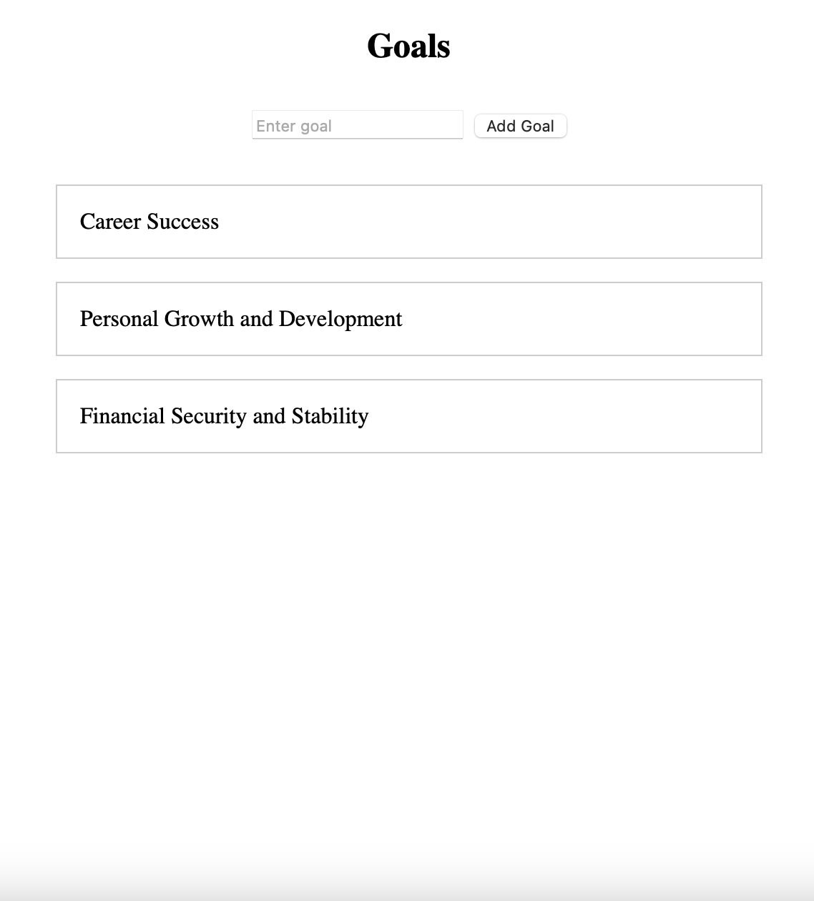
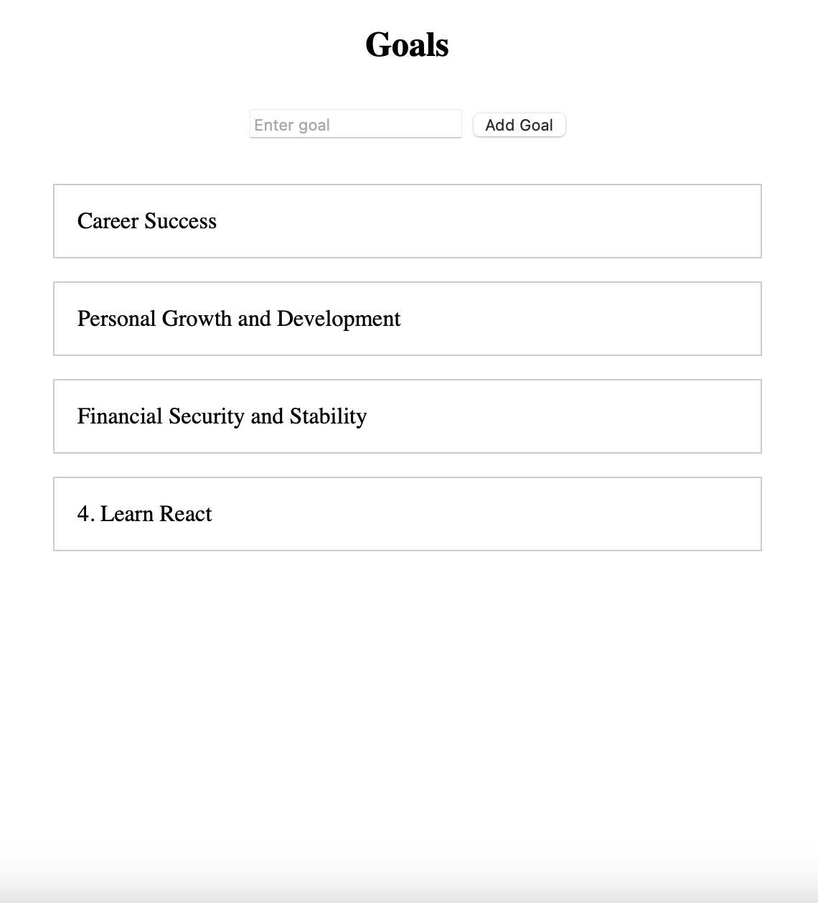

# Life Goals React app




# Getting Started with Create React App

This project was bootstrapped with [Create React App](https://github.com/facebook/create-react-app).

## Create a New React App

[Create React App](https://github.com/facebook/create-react-app) is a comfortable environment for **learning React**, and is the best way to start building **a new single-page application** in React.

To create a project, run:

```
npx create-react-app my-app
cd my-app
npm start
```

## Add Cypress

Next, we need to add Cypress:

```
$ yarn add --dev cypress@10.1.0
```

Add an NPM script for opening Cypress into your **package.json**

```
 {
   ...
   "scripts": {
     ...
     "test": "react-scripts test",
+    "cypress": "cypress open",
     "eject": "react-scripts eject"
   },
   ...
 }
```

Now run that command:

```
$ yarn cypress
```

A Cypress window will open. Choose "E2E Testing", click "Continue", for "Choose a Browser" select Chrome. Then click "Start E2E Testing in Chrome". The Cypress test runner will open.

Delete the default code:

- src/ App.css
- src/index.css
- src/logo.svg
- src/reportWebVitals.js

Make changes to **src/index.js**:

```
 import React from 'react';
 import ReactDOM from 'react-dom';
-import './index.css';
 import App from './App';
-import reportWebVitals from './reportWebVitals';

const root = ReactDOM.createRoot(document.getElementById('root'));
root.render(
  <React.StrictMode>
    <App />
  </React.StrictMode>,
);
-
-// If you want to start measuring performance in your app, pass a function
-// to log results (for example: reportWebVitals(console.log))
-// or send to an analytics endpoint. Learn more: https://bit.ly/CRA-vitals
-reportWebVitals();
```

And **src/App.js**:

```
export default function App() {
  return null;
}
```

## The Feature Test

When practicing outside-in TDD, our first step is to **create an end-to-end test describing the feature we want users to be able to do**. For our goals app, the first feature we want is to be able to enter a goal, add it, and see it in the list.

In the **cypress** folder, create an **e2e** folder, then inside it create a file **creating_a_goal.cy.js** and enter the test code.

```
// The steps a user would take interacting with app:
// - visiting the web site
// - entering the text "Improving physical health and fitness"
// - clicking an add button
// - confirming that the "Improving physical health and fitness" user entered appears somewhere on screen

describe("Creating a goal", () => {
  it("Displays the entered goal in the list", () => {
    const newGoal = "Improving physical health and fitness";
    cy.visit("http://localhost:3000");
    cy.get('[data-testid="goalText"]').type(newGoal);
    cy.get('data-testid="addButton').click();
    cy.get('[data-testid="goalText"]').type("");
    cy.contains(newGoal);
  });
});
```

Run the Cypress test by clicking **creating_a_goal** in the Cypress window. You should see the test run, then in the left-hand test step column you should see the following error:

> Timed out retrying after 4000ms: Expected to find element: [data-testid="goalText"], but never found it.

## Available Scripts

In the project directory, you can run:

### `npm start`

Runs the app in the development mode.\
Open [http://localhost:3000](http://localhost:3000) to view it in your browser.

The page will reload when you make changes.\
You may also see any lint errors in the console.

### `npm test`

Launches the test runner in the interactive watch mode.\
See the section about [running tests](https://facebook.github.io/create-react-app/docs/running-tests) for more information.

### `npm run build`

Builds the app for production to the `build` folder.\
It correctly bundles React in production mode and optimizes the build for the best performance.

The build is minified and the filenames include the hashes.\
Your app is ready to be deployed!

See the section about [deployment](https://facebook.github.io/create-react-app/docs/deployment) for more information.

### `npm run eject`

**Note: this is a one-way operation. Once you `eject`, you can't go back!**

If you aren't satisfied with the build tool and configuration choices, you can `eject` at any time. This command will remove the single build dependency from your project.

Instead, it will copy all the configuration files and the transitive dependencies (webpack, Babel, ESLint, etc) right into your project so you have full control over them. All of the commands except `eject` will still work, but they will point to the copied scripts so you can tweak them. At this point you're on your own.

You don't have to ever use `eject`. The curated feature set is suitable for small and middle deployments, and you shouldn't feel obligated to use this feature. However we understand that this tool wouldn't be useful if you couldn't customize it when you are ready for it.

## Learn More

You can learn more in the [Create React App documentation](https://facebook.github.io/create-react-app/docs/getting-started).

To learn React, check out the [React documentation](https://reactjs.org/).

### Code Splitting

This section has moved here: [https://facebook.github.io/create-react-app/docs/code-splitting](https://facebook.github.io/create-react-app/docs/code-splitting)

### Analyzing the Bundle Size

This section has moved here: [https://facebook.github.io/create-react-app/docs/analyzing-the-bundle-size](https://facebook.github.io/create-react-app/docs/analyzing-the-bundle-size)

### Making a Progressive Web App

This section has moved here: [https://facebook.github.io/create-react-app/docs/making-a-progressive-web-app](https://facebook.github.io/create-react-app/docs/making-a-progressive-web-app)

### Advanced Configuration

This section has moved here: [https://facebook.github.io/create-react-app/docs/advanced-configuration](https://facebook.github.io/create-react-app/docs/advanced-configuration)

### Deployment

This section has moved here: [https://facebook.github.io/create-react-app/docs/deployment](https://facebook.github.io/create-react-app/docs/deployment)

### `npm run build` fails to minify

This section has moved here: [https://facebook.github.io/create-react-app/docs/troubleshooting#npm-run-build-fails-to-minify](https://facebook.github.io/create-react-app/docs/troubleshooting#npm-run-build-fails-to-minify)
